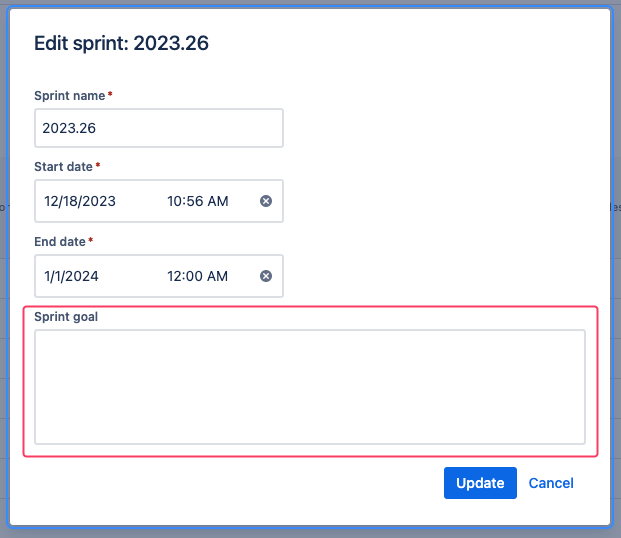

# Jira Extension

> This is a browser extension to beautify Jira boards.

## Features

1. Beautify spring goals section

## Installation

This project is not available to download in any webstore, so follow these steps:

1. [Download](https://github.com/thulioph/jira-extension/releases) the **latest** release available (`app.zip`)
2. Unzip it
3. Open in your browser `chrome://extensions/`
4. Turn `Developer mode` on (_top right_)
5. Click on `Load unpacked` (_top left_)
6. Select the unzipped folder
7. Extension should be visible

## Usage

All features will be automatically applied once you have it installed. Just open your board and see the magic happen. 🪄

### Beautify spring goals section

If your team uses the **sprint goal** section in Jira (_image below_), this extension will beautify it.

#### Requirements

- Each goal MUST be split by `-` (_minus sign_)
  - `- First Goal - Second Goal - Third Goal`

## Contributing

Pull requests are welcome. For major changes, please open an issue first
to discuss what you would like to change.

## License

[MIT](https://thulioph.mit-license.org/)
